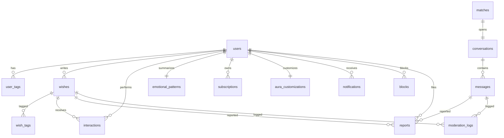

# Wishing Well PostgreSQL Schema

Production-oriented PostgreSQL schema for **Wishing Well**, an anonymous dating app centered on emotionally resonant short messages called **wishes**.

## Target Platform

- PostgreSQL 18.3 (latest stable at the time this package was prepared)
- Required extensions:
  - `vector` (`pgvector`)
  - `uuid-ossp`
  - `pg_trgm`
  - `btree_gin`
  - `pgcrypto` for `gen_random_uuid()` and SHA-256 email hashing
- Optional scheduler:
  - `pg_cron` if you want to run `expire_old_matches()` inside PostgreSQL

## Files

- `001_extensions.sql` enables extensions
- `002_enums.sql` defines all enum types
- `003_tables.sql` creates tables, constraints, foreign keys, and comments
- `004_indexes.sql` adds ANN, B-tree, trigram, and GIN indexes
- `005_functions.sql` adds business logic and helper functions
- `006_triggers.sql` wires lifecycle triggers
- `007_views.sql` creates product and admin-facing views
- `008_rls.sql` enables row-level security policies
- `009_seed.sql` inserts deterministic demo data

## Setup

Run the migrations in order:

```bash
psql "$DATABASE_URL" -f 001_extensions.sql
psql "$DATABASE_URL" -f 002_enums.sql
psql "$DATABASE_URL" -f 003_tables.sql
psql "$DATABASE_URL" -f 004_indexes.sql
psql "$DATABASE_URL" -f 005_functions.sql
psql "$DATABASE_URL" -f 006_triggers.sql
psql "$DATABASE_URL" -f 007_views.sql
psql "$DATABASE_URL" -f 008_rls.sql
psql "$DATABASE_URL" -f 009_seed.sql
```

After loading seed data, run:

```sql
ANALYZE wishes;
ANALYZE matches;
```

## Operational Notes

- All primary keys are UUIDs generated with `gen_random_uuid()`.
- All timestamps are `TIMESTAMPTZ` and should be read/written in UTC.
- Raw emails are never stored. Persist `digest(lower(trim(email)), 'sha256')` into `users.email_hash`.
- `users.is_premium` and `subscriptions` are both supported so the application can cache entitlement state while still preserving subscription history.
- `check_daily_wish_limit()` enforces a **3 wishes per UTC day** rule for free users.
- `find_resonant_matches()` uses `pgvector` cosine similarity and excludes blocked users plus active existing matches.
- `soft_delete_wish()` preserves the record for audit history and expires pending matches involving that wish.
- `expire_old_matches()` is safe to call repeatedly and returns the number of rows expired.

Example scheduler call:

```sql
SELECT cron.schedule(
  'expire-wishing-well-matches',
  '0 * * * *',
  $$SELECT expire_old_matches();$$
);
```

## RLS Usage

The RLS policies expect the application to set a session GUC before querying:

```sql
SET app.current_user_id = '00000000-0000-0000-0000-000000000000';
```

Protected tables:

- `users`
- `wishes`
- `messages`
- `notifications`
- `conversations`
- `blocks`

## Schema Map



## View Intent

- `v_public_wish_feed`
  - Public, unmoderated, non-PII wish stream with aggregated tags
- `v_user_emotional_summary`
  - Safe profile summary using anonymous names and emotional aggregates
- `v_active_matches`
  - Opened matches with conversation activity for dashboard or demo use
- `v_match_graph`
  - Edge list for graph visualizations between anonymous users

## Seed Summary

`009_seed.sql` loads:

- 20 users
- 60 wishes
- 30 interactions
- 10 matches
- 5 active conversations
- 25 messages
- notifications, reports, moderation logs, subscriptions, blocks, and aura customizations

The seed data is deterministic and designed to be rerunnable without duplicating rows.
